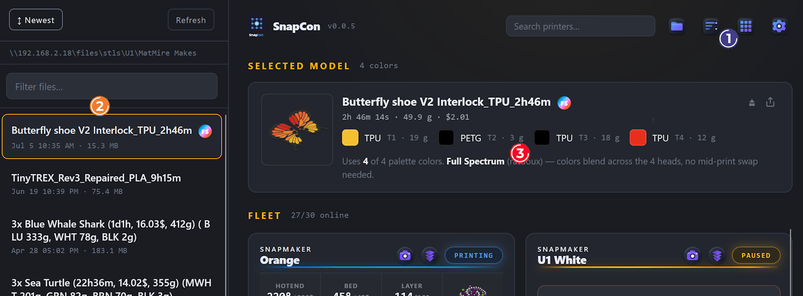
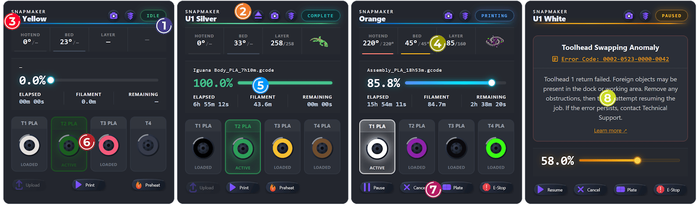
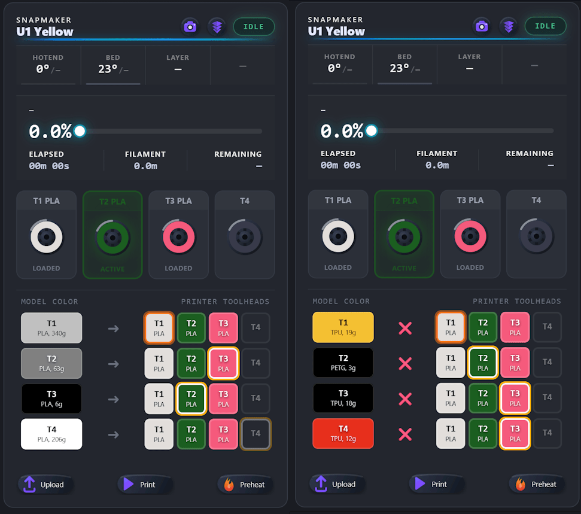

# SnapCon  
SnapCon started as a personal project to better manage and monitor my small Snapmaker U1 print farm through Home Assistant.  
My original goal was to build a Home Assistant integration that would provide everything I needed to control and monitor my printers from a single dashboard.

While working on that integration, I discovered Danny Gimbell's excellent [U1Hub](https://github.com/dlgambill/u1hub) project.  
It already solved several challenges and introduced capabilities that simply couldn't be achieved cleanly  
within Home Assistant alone. Rather than reinventing the wheel, I decided to fork U1Hub and build on top of  it.

What began as a few small modifications quickly grew into something much larger.

As development continued, SnapCon gradually evolved beyond the original concept. New features, a different  
architecture, and a broader vision pushed the project in a direction that was no longer just an extension of U1Hub, but a project of its own. While it still owes its origins to Danny's work, the codebase, goals, and  feature set have diverged significantly.

Today, SnapCon focuses on providing a powerful management platform for Snapmaker U1 printers and print farms,
with an emphasis on usability, automation, monitoring, and features that extend well beyond what Home Assistant alone can provide.  

This project would not have existed without the inspiration and foundation provided by Danny Gimbell's U1Hub, and I would like to thank him for creating and sharing it with the community.

I hope SnapCon will be as useful to other makers and print farm operators as it has been for me.    

(SnapCon talks straight to each printer's built-in Moonraker API. Nothing leaves your network.)
  
### SnapCon Core Features
#### Fleet Dashboard
* Live grid of all configured printers, each displayed as its own card
* Real-time status tracking: Idle, Printing, Paused, Complete, Error, Offline
* Compact view mode to fit more printers on screen at once
* Color-coded accent line per card, reflecting its current state (error, paused, complete, etc.)

#### Printer Card
* Brand, printer name, and status badge
* Stats bar with hotend temp, bed temp, current layer, and print thumbnail
* Progress bar showing filename, completion percentage, and elapsed / remaining / filament times
* Filament Spool Lanes (T1, T2, ...) showing material type and color
* Error panel with SnapMaker error lookup, description, and a "Learn more" link
* Quick-action buttons to Eject (when idle or complete, with a file loaded), Camera snapshot, Open Fluidd
* Visual exclude-object map for multi-part prints — skip individual objects mid-print
* Set target hotend and bed temperatures per printer

#### Print Controls (footer buttons)
* Idle state: Upload file, Print, Preheat
* Busy state: Pause / Resume, Cancel, E-Stop, Plate map (for multi-object prints)

#### Fleet Search
* Text search across brand, printer name, and state
* Status filter — Idle, Printing, Error, etc.
* Color-family search — type "Yellow," "Red," "Blue," etc. to find printers by filament color
* Progress filter — e.g. >75% or < 30% to filter by print completion

#### File Management
* Collapsible folder/file browser sidebar
* Sort files and select one to send to a printer
* Select multiple printers and send a file, with color-mapped tool assignments

### Interface

① **Control Buttons** - Clicking the folder icon opens the local gcode repository (configurable), which appears as a pane on the left side (as shown), letting you upload files from it. The second icon controls printer display sorting (No Sort (by order added), By Status, or By Time Remaining). The next button toggles Compact Display (smaller cards with reduced functionality, letting you fit more printers on screen). The last button opens the app's settings/configuration.
The search field lets you search by printer name, spool color, or job progress (e.g. >30%).
② **Files/Folder Pane** - Opens when you click the folder icon, showing the contents of your configured gcode folder. Clicking a file lets you upload it either directly from a printer card's Upload button, or to all printers at once via "Upload All" on the Selected Model card.
③ **Selected Model Card** - Shows details about the selected file: slicer print time, weight, cost (if configured in settings), and the spool colors/materials required. If the file is a Full Spectrum file, an "FS" indicator appears next to the filename. The Selected Model card has two icons — one to eject the file (deselect it), and one to upload it to all printers.

### Printer Card:
  The printer card appears in four variations, Printing, Idle, Completed Job, and Error with cards displayed in that order.

  
① **Printer Status** - current job state (Printing, Idle, Paused, etc.)  
② **Control Icons** - quick actions: view the camera snapshot, open the web interface (Fluidd), and eject filament (if a file is loaded)
③ **Printer Name** - the custom nickname assigned to this printer
④ **Printer Job Stats** - active hotend temp, bed temp, and layer number, plus the gcode thumbnail (click it to view the full-size image)
⑤ **Printing Job Status** - file name, progress percentage, and elapsed / remaining time
⑥ **Filament Spool Status** - shows all spools on the printer, with the active one highlighted (click a spool to unload it, or unload all spools at once)
⑦ **Control Buttons** - job actions: Print (if no job is loaded, lets you choose a file from the printer), Pause, Resume, Cancel, Plate (click to exclude objects from the current plate), Upload, and E-Stop (emergency stop, restarts Klipper)
⑧ **Error Handling** - if an error occurs, the printer pauses and displays the error message. In many cases the issue can be resolved directly, for example, a "Toolhead Swapping Anomaly" may be caused by a loose object on the plate: remove the item, exclude it from the print, and resume

### Color-to-Spool Mapping
When you load or select a file on a printer card, it lets you perform Filament Mapping — assigning each color in the file to a physical spool. Depending on your configuration, this happens either by direct index (T1→T1, T2→T2, ...) or automatically, matching file colors to the closest available spools using a Hungarian-style matching algorithm.
You can always override this and assign colors to spools manually.
Note: if the file requires different materials than what's currently loaded, an ✕ will appear on the affected mapping(s). Printing is still possible in this case — but proceed at your own risk.

---

## Download (no Node.js needed)

Grab the build for your OS from the **[Releases](../../releases)** page, put it in
its own folder, and run it — a browser opens to the dashboard.

- **Windows** (`snapcon-win-x64.exe`): SmartScreen may warn "unknown publisher"
  (the app isn't code-signed). Click **More info -> Run anyway**.
- **macOS** (`snapcon-macos-AppleSilicon` / `-Intel`): right-click -> **Open**
  the first time to clear Gatekeeper, or run `xattr -dr com.apple.quarantine <file>` once.
  You may need to `chmod +x` it.
- **Linux** (`snapcon-Linux-x64`): `chmod +x` then run it.

`config.json` and a `gcode/` folder are created next to the executable on first run.
Use **Settings** in the page to add your printers.

> **Already running on port 4545?** Only one copy can use the port. If a launch flashes
> and closes, something else (often a second copy) already has 4545 — close it first.

## Run from source (developers)
### 1. Install

You need **Node.js 18 or newer** — get the **LTS** build from https://nodejs.org and
run the installer (defaults are fine). Then:

1. Unzip this folder somewhere permanent, e.g. `C:\snapcon`.
2. Start it:
   - **Windows:** double-click **`start-windows.bat`**
   - **Mac / Linux:** run **`./start-mac-linux.sh`** in a terminal

The first launch installs what it needs (takes a minute) and then opens
**http://localhost:4545** in your browser.

> **Use it from your phone:** find the IP of the computer running the hub and open
> `http://THAT-IP:4545` on your phone — e.g. `http://192.168.1.20:4545`. Keep the hub
> running on a computer that stays on (or set the launcher to run at startup).

### 2. First-time setup (all in the browser)

The **Settings** panel opens automatically the first time. Three steps:

1. **Add your printers.** Click **Discover on network** to scan your LAN and list any
   Snapmaker U1s it finds — click **Add** on each. (Or **Add manually** and type an IP.)
2. **Set your G-code folder.** Point it at the folder Snapmaker Orca saves sliced files to.
3. **Save.**

Reopen Settings anytime with the gear button.

---

---
## License
MIT — see `LICENSE`. Free to use, change, and share.

