# SnapCon
SnapCon is a local-first fleet management platform built primarily for Snapmaker U1 print farms.

The project was created to manage my own small farm of 25 Snapmaker U1 printers. Its architecture, interface, and ongoing development are centered around the capabilities, workflows, and operational needs of the U1.

SnapCon provides a single interface for monitoring, controlling, and managing multiple printers without requiring printer activity or operational data to be sent to a third-party cloud service.

For Snapmaker U1 farms, SnapCon provides capabilities such as:

* Centralized printer and fleet monitoring
* Active print-job tracking
* Job controls and printer-management actions
* Camera snapshots and printer previews
* Four-toolhead status and material monitoring
* Toolhead and filament mapping
* Compact and detailed dashboard views
* Printer sorting, grouping, and organization
* Farm-level visibility across multiple U1 printers
* Home Assistant integration
* Optional secure remote access
* Local operation without a mandatory cloud dependency

SnapCon communicates directly with each U1 through its local Klipper and Moonraker interfaces. Nothing needs to leave the local network unless Remote Access is explicitly enabled.

Support for additional printer platforms was added in response to requests from users with mixed printer farms. Experimental connectors currently include selected FlashForge, Creality, and generic Klipper/Moonraker printers.

These additional connectors are not the main focus of the project and may not provide the same depth of functionality, testing, or integration available for the Snapmaker U1. SnapCon’s development priorities remain focused on the U1 and its specific capabilities.

SnapCon began as a personal project for managing my own printers. An early version used Danny Gimbell’s U1Hub project as a starting point. Since then, the codebase, architecture, functionality, and direction have changed substantially, and SnapCon has developed into a separate project.

SnapCon is intended primarily for Snapmaker U1 owners and farm operators who need a practical, centralized, and locally controlled way to manage multiple printers from one interface.

---
Enjoying SnapCon? Consider buying me a coffee (or two).
Every bit helps fund new printers so I can expand support to more models.
[](https://buymeacoffee.com/ebzed)

---
## SnapCon Core Features

### Fleet Dashboard, four view modes
SnapCon has one fleet view that reshapes itself into four different layouts, cycled with the view  
button in the top bar (⊞ icon). Which views that button cycles through or whether it just toggles one specific view on and off is configurable in **Settings → View → Alternate Display**.

#### Regular View
The default view, every printer as a full card: stats bar, filament lanes, progress, and every control  
on screen at once. Best for smaller fleets, or whenever you want the complete picture for each printer without drilling in.
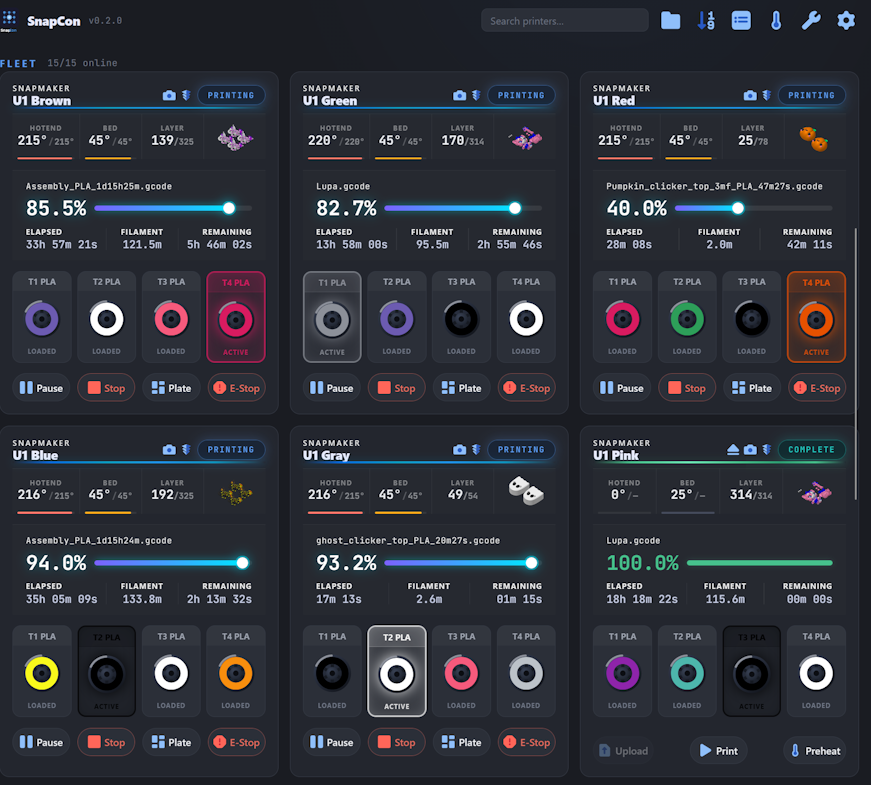

#### Compact View
The same cards, shrunk down, smaller stats, fewer buttons, no filament-lane detail. Built for fitting a larger fleet on one screen.
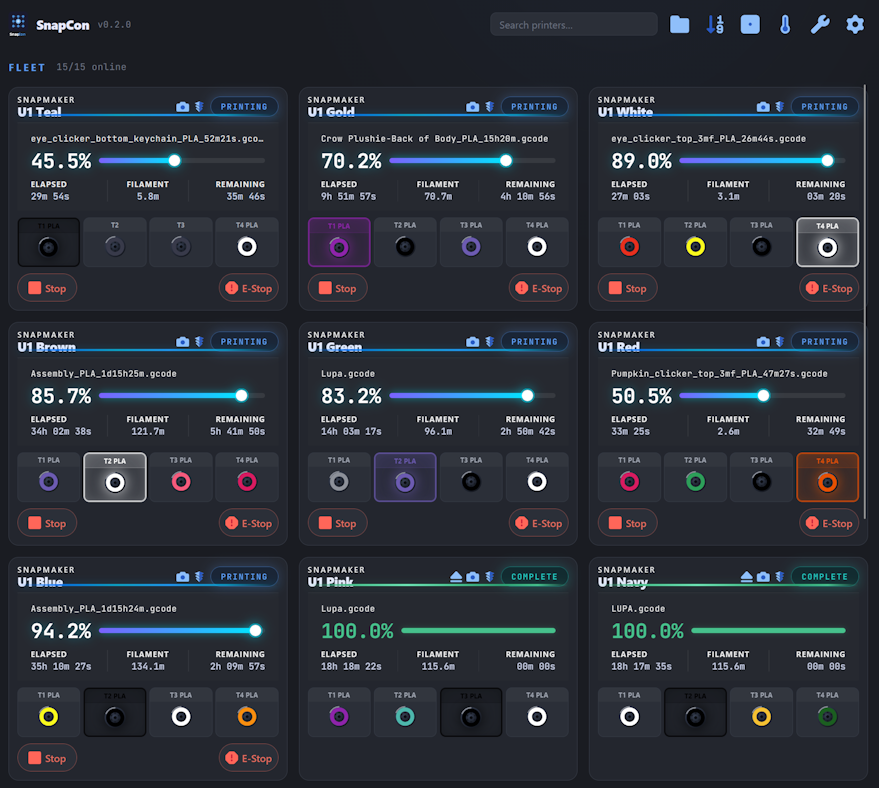

#### Camera View  
A grid focused on each printer's live camera feed, refreshed on an interval you control (with optional staggered refresh so a large fleet's cameras don't all fire at once). Printers without a camera, or with a broken feed, show a retryable placeholder instead. Shares a toolbar with List View: status tabs, tag filter, multi-select with bulk Pause/Resume/Cancel, and tag editing.
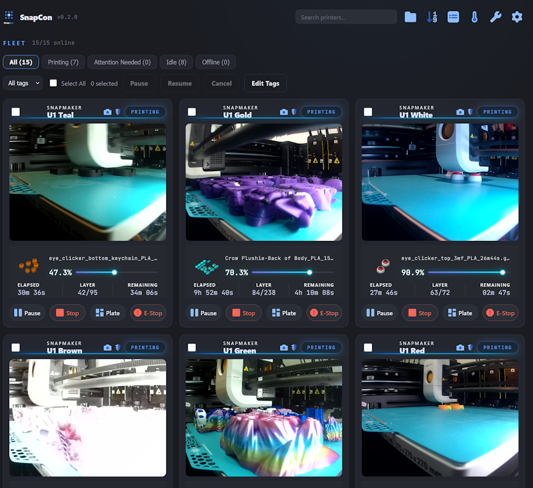

#### List View
The same fleet as a dense, sortable table, one row per printer, with file thumbnail, a real progress bar, remaining time and layer count, and a filament column showing each loaded toolhead as a colored chip. Uses the same toolbar, multi-select, and bulk actions as Camera View.
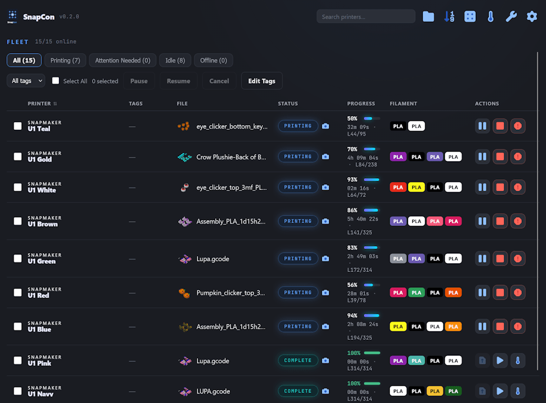

Regardless of view, when "No Sort" (the default) is selected you can reorder printers manually via  
drag-and-drop, dragging from the printer's status badge to the desired position. Sort by Status,  
by Time Remaining, or by Name are also available.

For a detailed explanation of the printer card, see the [Printer Card documentation](docs/printer-card.md).


### Plate View and Object Exclusion
The Plate button Shows up on a printer card's footer only while it's actively printing or paused, and only when the current print actually has more than one object on the plate.  

Clicking it opens a modal with two synced views of the same plate:

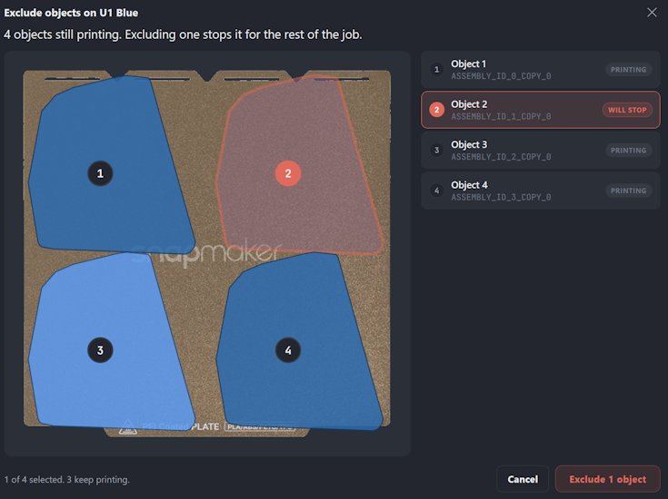

1. A visual map rendered from the actual gcode object outlines, overlaid on a photo of the real U1 bed so objects appear exactly where they physically sit.  
2. A list below/beside it, one row per object.

Both are clickable, Clicking an object's shape on the map or its row in the list does the same thing: toggles that object into your selection.  
Nothing is sent to the printer yet at this point, it's just building up your selection.

Each object is visually in one of four states:
- Normal, still printing, not selected
- Selected, your current picks (highlighted)
- Currently printing, tagged "printing" (the object the nozzle is on right now)
- Already skipped, grayed out, tagged "skipped", no longer clickable

Once you've selected one or more objects, a Skip (N) button becomes active. Clicking it sends an exclude command for each selected object, one at a time, showing "Skipping N…" then  
"Skipped N" when done.  

There's no "undo", once an object is skipped, it's permanently marked skipped for that print, same as if you'd excluded it from the printer's own screen.

### Heat Multiple Printers

<p>
  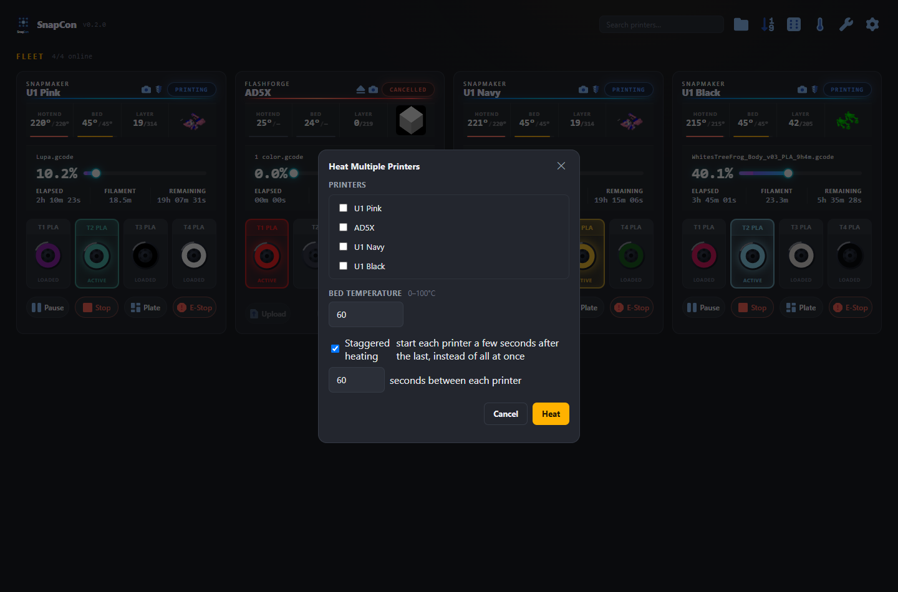

 A thermometer icon in the top bar opens a bulk bed temp. control:
 pick any number of online printers, set a target bed temperature,  
 and optionally enable <strong>Staggered heating</strong> to start each printer
 a configurable number of seconds after the last, rather than all at once.
 <br>

This is useful on a shared circuit where heating an entire farm's beds
simultaneously could trip a breaker.
<br>

Per-printer progress is shown live as each one is set, and closing the
dialog stops any staggered run still in progress.
</p>
<br clear="all">

### Printer Maintenance

<p>
  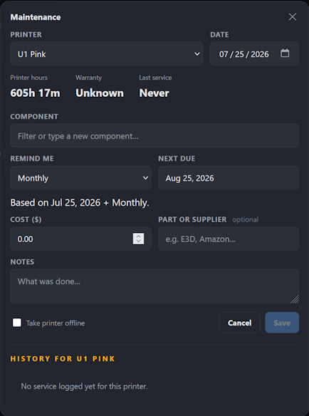

Printer Maintenance lets you specify which component or operation  
is under maintenance, Each operation comes with a preconfigured  
frequency (based on the manufacturer's recommendations), and the  
next maintenance date is scheduled automatically.  

A cost parameter was also added to maintenance entries, laying the  
groundwork for future TCO (total cost of ownership) tracking.
Additionally, an Offline button lets you take a printer offline  
while offline, no actions can be performed on it.  
Once set to offline, the button switches to "Online" and clicking  
it brings the printer back.

The same panel also shows each printer's **total print hours**   
(pulled from its own history) and an automatic **warranty status**  
active for 12 months from the purchase date you set, then flagged  
as expired without you needing to track either by hand.

</p>
<br clear="all">

# SnapCon Configuration
SnapCon settings can be accessed by selecting the gear icon in the top navigation bar. This opens the Settings screen, where configuration options are organized into separate tabs.

The sections below describe the available options in each settings tab

### Settings
The General tab contains the core settings that control where SnapCon finds print files, how often it checks printer status, and how print costs are calculated.

<p>
  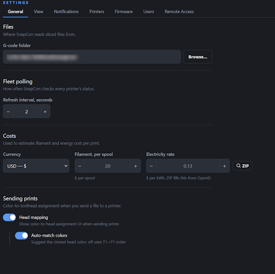


- Files: Select the folder SnapCon monitors for sliced .gcode files. A live status message confirms whether the path exists, is accessible, and contains compatible files as you type or use Browse.
- Fleet Polling: Set how often SnapCon checks each printer’s status, from 1 to 60 seconds. A helper message shows the estimated requests per minute and warns when the selected interval may be too aggressive, especially for larger farms.
- Costs: Configure the currency, filament spool cost, and electricity rate per kWh used to estimate print costs on job cards. The ZIP Lookup button can retrieve a suggested local electricity rate from the OpenEI utility-rate database.
- Sending Prints: Choose whether SnapCon displays the color-to-toolhead mapping screen before sending a file. You can also enable automatic matching to the closest available toolhead color or use direct T1 → T1 assignment.
- Application (Docker only): Use Restart App to restart the SnapCon container. This is useful after editing config.json outside SnapCon or pulling a newer container image.

</p>
<br clear="all">


### View 
The View tab controls how the printer fleet is displayed and how the view-switch button in the header behaves.

<p>
  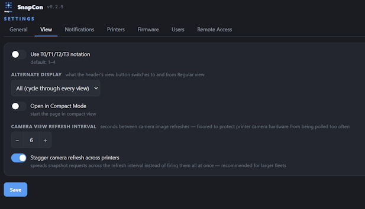


- Use T0/T1/T2/T3 Notation:Changes toolhead numbering from the default 1–4 format to the zero-based T0–T3 format.
- Alternate Display: Selects which view the header’s view-switch button opens or cycles through. 
- Open in Compact Mode: Opens the fleet dashboard in the Alternate view instead of Regular view.
- Camera View Refresh Interval: Sets how often camera snapshots refresh while using Camera view.
- Stagger Camera Refresh Across Printers: Distributes camera snapshot requests across the selected refresh interval instead of requesting all printer images at once. 

</p>
<br clear="all">

### Notifications (Telegram / ntfy.sh)

<p>
  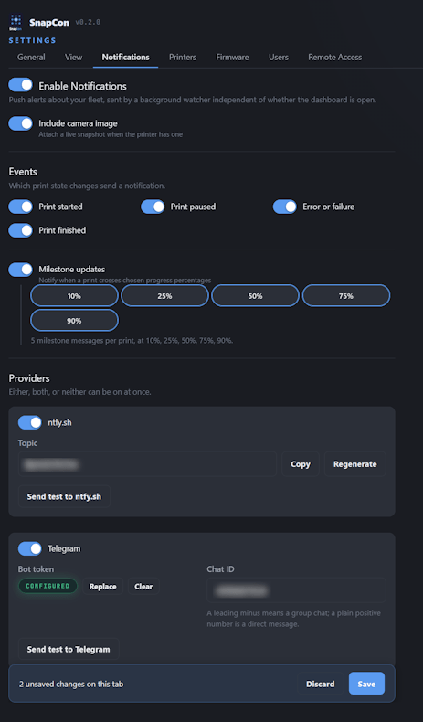

Push notifications for what's happening across your fleet, sent by a   
background watcher that runs independently of whether the dashboard is even open.  
Configured in Settings → Notifications:

- Enable Notifications, the master switch. Turn it off and everything below stops sending, without losing any of your settings.
- Include camera image, attaches a live snapshot to the notification, if that printer has one.

Events, choose exactly which print events you want to hear about, independently:
- Print started
- Print paused
- Error or failure
- Print finished

Want alerts only when something goes wrong? Turn on just "Error or failure" and leave the rest off.

Milestone updates — a separate switch for progress-percentage alerts, e.g. "50% done." Pick any combination of 10%, 25%, 50%, 75%, and 90% — you're not locked into fixed checkpoints, and a live counter shows how many messages per print your selection adds up to.

- ntfy.sh needs just a topic (think of it as a channel name). Regenerate makes you a fresh random one, and Copy puts it on your clipboard for pasting into the ntfy app. Since anyone who knows your topic can read your notifications, treat it like a shared secret, regenerating immediately cuts off anyone still subscribed to the old one.
- Telegram needs a bot token and a chat ID. 

</p>
<br clear="all">

### Printers
he Printers tab is used to add, configure, organize, and maintain the printers connected to SnapCon.
SnapCon is built primarily around the Snapmaker U1. Its Klipper/Moonraker-based connector enables features such as automatic printer detection, identity lookup, and network discovery.


<p>
  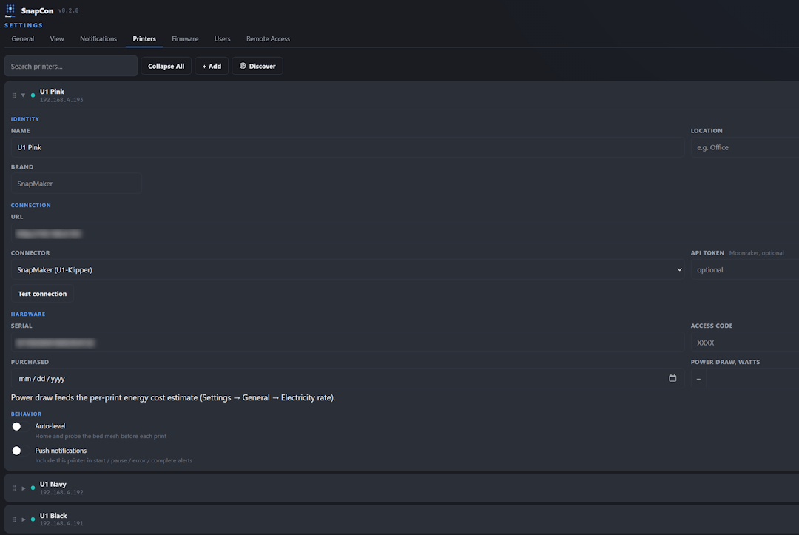


Each printer entry can be expanded to configure the following sections:

- Identity: Printer name, location, and brand label.
- Connection: Printer URL, connector type, optional Moonraker API token, and a Test Connection action that verifies connectivity before saving.
- Hardware: Serial number, Snapmaker U1 pairing access code, purchase date, and estimated power draw in watts. Power usage is combined with the electricity rate configured under General to estimate energy cost per print.
- Behavior:Options such as automatic bed leveling before each print and whether the printer should participate in push notifications. 

</p>
<br clear="all">

Printer entries can be searched, collapsed, and reordered by dragging. Additional actions are available from the ⋮ menu (Including: Maintenance history, Move up, Move down & Remove printer)

#### Printers Discovery
The Discover Button Scans the local network for supported printers and lets you add them without entering IP addresses manually.

- Scan Scope: Scan all subnets connected to the SnapCon host, or enter a specific subnet or CIDR   range. Custom scans are limited to /20 to prevent excessively large searches.
- Discovery Process: SnapCon probes ports 80 and 7125 in parallel, covering Moonraker installations running directly or behind a proxy. A typical /24 scan usually completes in about 10 seconds.

Each result shows the available printer details and an Add button. Printers already configured in SnapCon are marked as Added. During first-time setup, Add All & Save can be used to add all discovered printers at once.

## Remote Access
<p>
  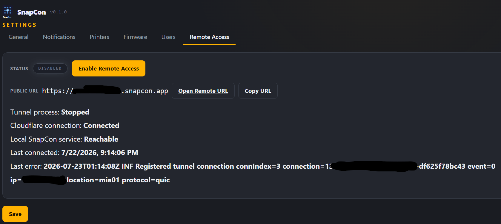
SnapCon can securely expose your printer farm dashboard over the internet, allowing you to monitor prints, manage jobs, and access your printers from a phone or another device while away from home while No router configuration, port forwarding, VPN client, reverse proxy, or manual certificate management is required.

SnapCon uses a managed Cloudflare Tunnel, Instead of opening an inbound port on your router, SnapCon creates an outbound connection to Cloudflare. Cloudflare provides a public HTTPS address and securely relays traffic through the tunnel to your local SnapCon instance.

This means:
* No open inbound firewall ports
* No manual router configuration
* No VPN software required on client devices
* A valid HTTPS address and certificate
* No manual `cloudflared` configuration
* Remote Access can be enabled directly from SnapCon settings

Remote Access cannot be enabled unless User Access Management is active and at least one user account exists.

</p>
<br clear="all">


### Cost Tracking
Set an average filament cost (per spool) and an electricity rate ($/kWh), and SnapCon estimates filament +
energy cost per print (shown on the Selected Model card and in the print-from-printer picker). Don't know your
electricity rate off-hand? Enter a US ZIP code and SnapCon looks it up for you (via the OpenEI utility-rate
database), pre-filling the field with your local utility's residential rate.

### Firmware
**Settings → Firmware → Get Firmware** reads the current firmware version from every idle printer in the
fleet at once, so you can spot who's behind without opening each printer's own web UI. (One-click Deploy is
planned but not implemented yet.)

### Fleet Search
- Text search across brand, printer name, and state
- Status filter — Idle, Printing, Error, etc.
- Color-family search — type "Yellow," "Red," "Blue," etc. to find printers by filament color
- Progress filter — e.g. `>75%` or `<30%` to filter by print completion

### File Management
- Collapsible folder/file browser sidebar, with search that recurses into every subfolder (not just the
  current one)
- Create new folders and upload files directly from your PC, without touching the gcode folder manually
- Multi-select, Explorer-style: Shift-click for a range, Ctrl-click to toggle individual files, then
  drag the selection onto a folder to move everything at once
- Sort files and select one to send to a printer
- Select multiple printers and send a file, with color-mapped tool assignments
- A progress bar is shown for each printer during a multi-printer upload, indicating its individual status
- Full Spectrum files are detected automatically and flagged with an "FS" badge wherever the filename
  appears (file list, job title, print-from-printer picker), along with which fork produced them

---

### Interface
① **Control Buttons** — Clicking the folder icon opens the local gcode repository (configurable), which appears as a pane on the left side, letting you upload files from it. Next is Sort files, New Folder, Upload from PC, and Refresh. On the right: Sort printers (No Sort / By Status / By Time Remaining / By Name), the view-mode button described above, Heat Multiple Printers, Maintenance, and Settings.
The search field lets you search by printer name, spool color, or job progress (e.g. `>30%`).
② **Files/Folder Pane** — Opens when you click the folder icon, showing the contents of your configured gcode folder. Clicking a file lets you upload it either directly from a printer card's Upload button, or to all printers at once via "Upload All" on the Selected Model card.
③ **Selected Model Card** — Shows details about the selected file: slicer print time, weight, cost (if configured in settings), and the spool colors/materials required. If the file is a Full Spectrum file, an "FS" indicator appears next to the filename. The Selected Model card has two icons — one to eject the file (deselect it), and one to upload it to all printers.


### User Management
A new option under General Settings lets you enable "Enable User Access Management."
Once turned on, logging in becomes required to use SnapCon. This is also a prerequisite for Remote Access (above).
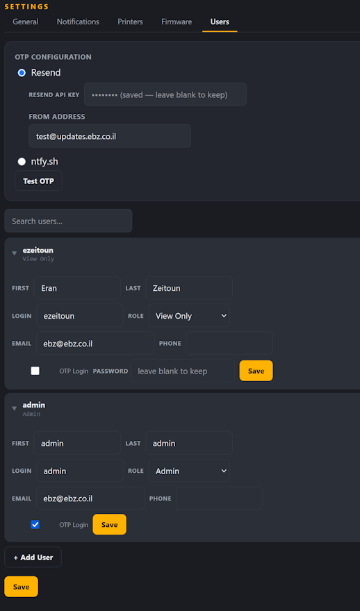
#### OTP Login
configured at the top of the panel, lets you skip setting a password for a user entirely.
Instead, a one-time password is sent at each login, delivered either by email (via the Resend
service) or via ntfy.sh (using the same notification channel as your printers, or a separate one
you create just for this).

#### Adding a user
Enter their first name, last name, and desired login name, then assign a role:
**View**, read-only, no control over printers
**Regular**, full control over printers
**Admin**, full control, plus access to SnapCon's own configuration

You can also set an email address (required for OTP) and a phone number
(reserved for future SMS-based OTP support).
To use OTP login for a user, check the OTP Login checkbox.
Otherwise, set a password for that user directly.


### CLI / slicer integration hook
SnapCon ships a small command-line hook any slicer's post-processing step can call to hand a sliced file
straight to a printer, without opening the browser at all:
```
snapcon-win-x64.exe --load <file> --printer "<name in SnapCon>" [--outputname "<display name>"] [--snapcon <host[:port]>]
```
`--snapcon` targets a SnapCon instance running on a *different* machine than the slicer; omit it when Orca (or
any other slicer) runs on the same machine as SnapCon. This is the same mechanism the Experimental Orca
"Plugin" below is built on.

### Experimental Orca "Plugin"
For those who prefer working with Orca Slicer instead of Snapmaker Orca (Snorca), an option was added to "connect" Orca to SnapCon using the CLI hook above.
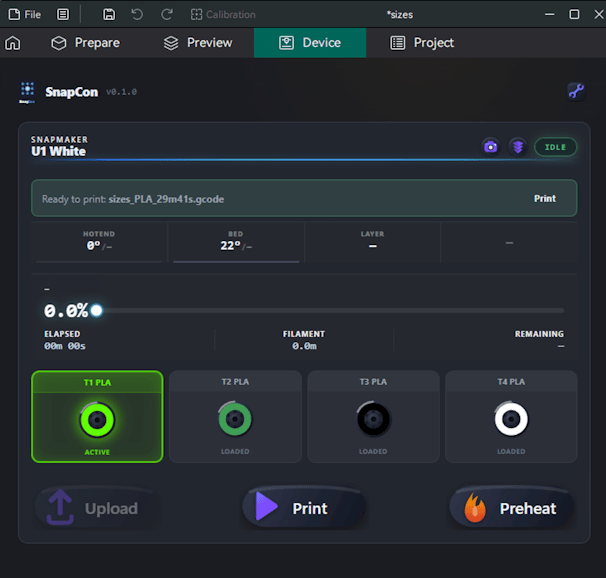
This is an experimental feature, to get it working, configure your connection as shown below:
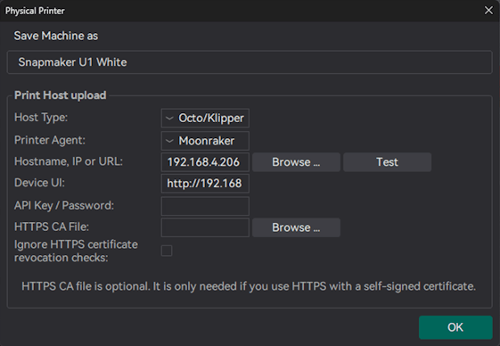
**Hostname**: enter the actual hostname/IP of the printer
**Device UI**: enter http://snapcon-ip:4545/orca/Printer-Name-in-SnapCon

After saving, go to the Process settings' Other tab and add a Post-Processing Script, pointing to a batch file that runs:
``D:\snapcon-win-x64.exe --printer "U1_White" --snapcon x.x.x.x --outputname "%SLIC3R_PP_OUTPUT_NAME%" --load %1``
(If Orca is running on the same machine as SnapCon, --snapcon can be omitted.)
After clicking Upload or Upload/Print — neither of which actually performs an upload or print operation — you can switch to the Device tab to control the printer.

Depending on feedback on this feature, the final GUI in the Device tab may end up matching Snapmaker Orca's (Snorca) Device Control interface exactly.

### Docker support
Running inside a container is auto-detected (no configuration needed) and unlocks a **Restart App** button
in General Settings — restarts the container in place to pick up a `config.json` edited from outside SnapCon,
or a freshly pulled image, without needing shell access to the host.

---

## Download (no Node.js needed)

Grab the build for your OS from the **[Releases](../../releases)** page, put it in
its own folder, and run it — a browser opens to the dashboard.

- **Windows** (`snapcon-win-x64.exe`): SmartScreen may warn "unknown publisher"
  (the app isn't code-signed). Click **More info -> Run anyway**.
- **macOS** (`snapcon-macos-AppleSilicon` / `-Intel`): right-click -> **Open**
  the first time to clear Gatekeeper, or run `xattr -dr com.apple.quarantine <file>` once.
  You may need to `chmod +x` it.
- **Linux** (`snapcon-Linux-x64`): `chmod +x` then run it.

`config.json` and a `gcode/` folder are created next to the executable on first run.
Use **Settings** in the page to add your printers.

> **Already running on port 4545?** Only one copy can use the port. If a launch flashes
> and closes, something else (often a second copy) already has 4545 — close it first.

## Run from source (developers)
### 1. Install

You need **Node.js 18 or newer** — get the **LTS** build from https://nodejs.org and
run the installer (defaults are fine). Then:

1. Unzip this folder somewhere permanent, e.g. `C:\snapcon`.
2. Start it:
   - **Windows:** double-click **`start-windows.bat`**
   - **Mac / Linux:** run **`./start-mac-linux.sh`** in a terminal

The first launch installs what it needs (takes a minute) and then opens
**http://localhost:4545** in your browser.

> **Use it from your phone:** find the IP of the computer running the hub and open
> `http://THAT-IP:4545` on your phone — e.g. `http://192.168.1.20:4545`. Keep the hub
> running on a computer that stays on (or set the launcher to run at startup), or turn on
> Remote Access (above) to reach it from outside your LAN too.

### 2. First-time setup (all in the browser)

The **Settings** panel opens automatically the first time. Three steps:

1. **Add your printers.** Click **Discover on network** to scan your LAN and list any
   supported printers it finds — click **Add** on each. (Or **Add manually** and type an IP.)
2. **Set your G-code folder.** Point it at the folder your slicer saves sliced files to.
3. **Save.**

Reopen Settings anytime with the gear button.

---
## License
MIT — see `LICENSE`. Free to use, change, and share.
