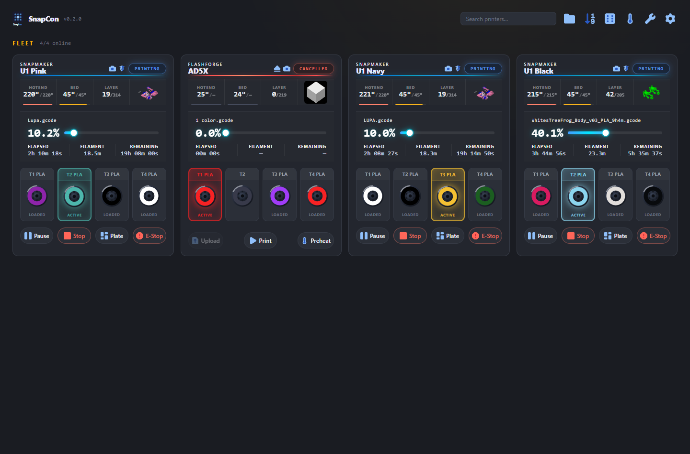
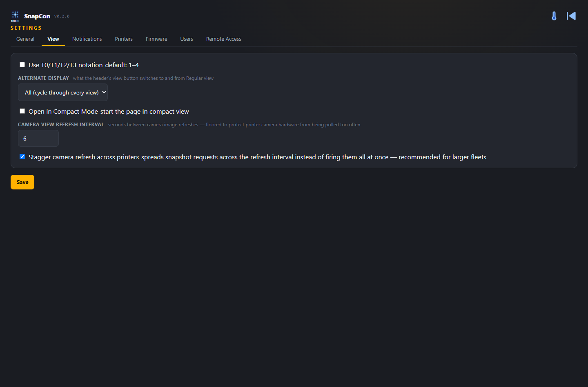
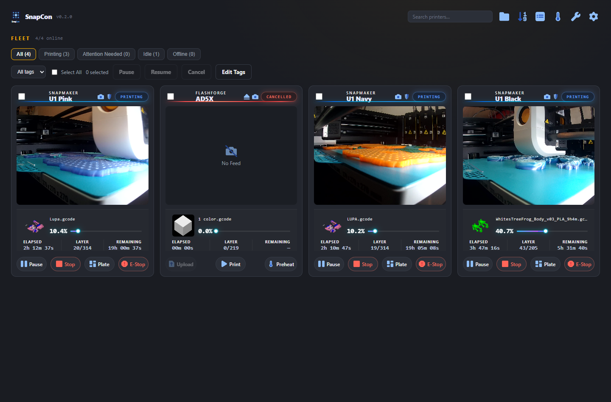
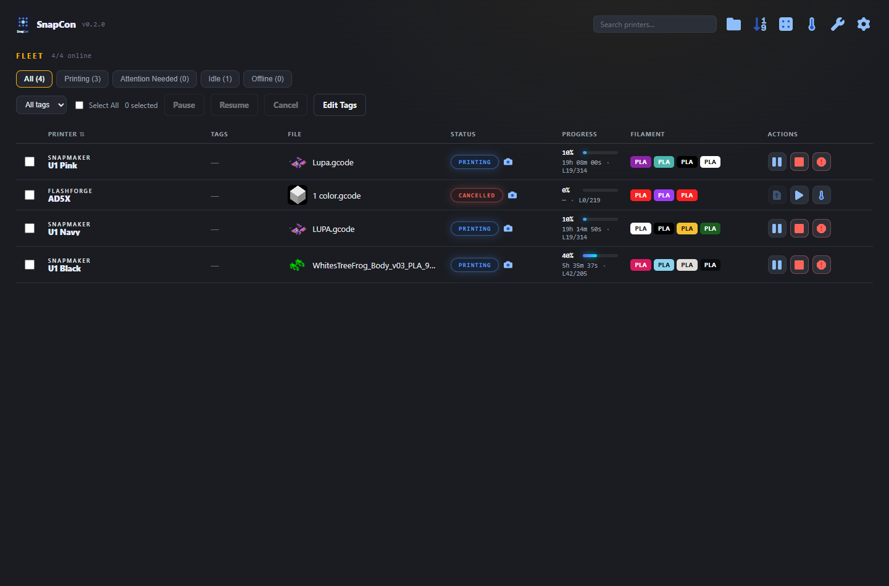
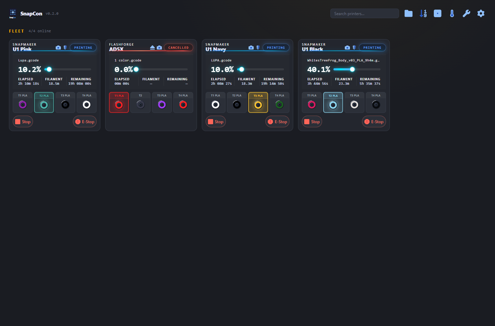
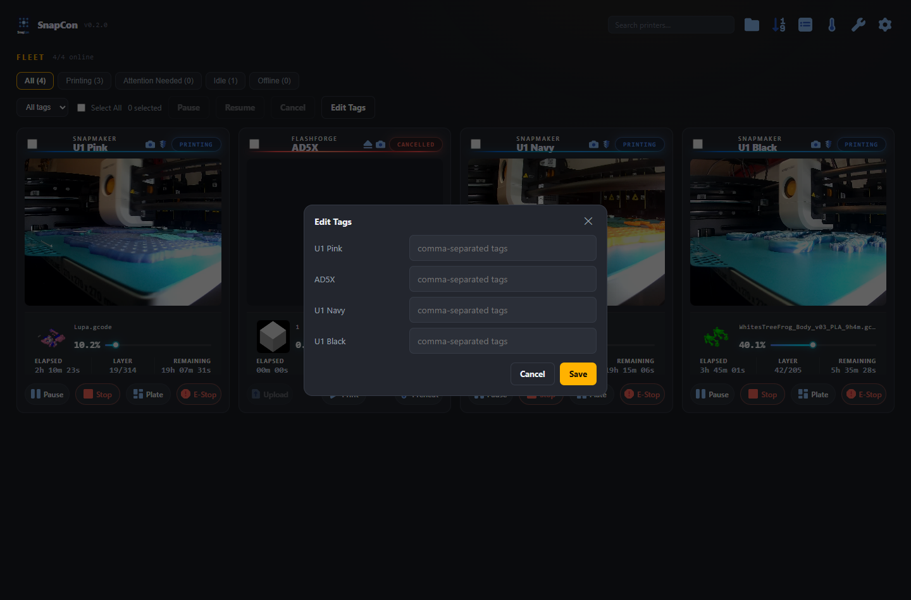
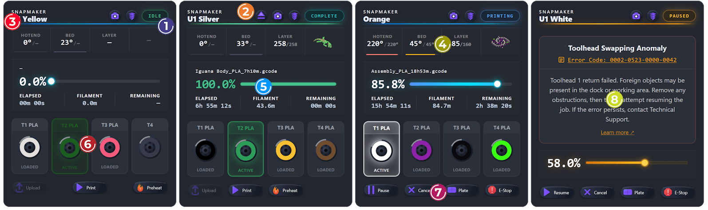
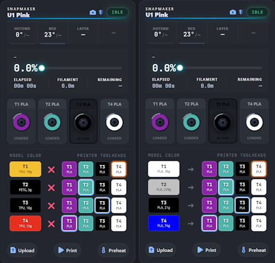

# SnapCon
SnapCon started as a personal project to better manage and monitor my small Snapmaker U1 print farm through Home Assistant.
My original goal was to build a Home Assistant integration that would provide everything I needed to control and monitor my printers from a single dashboard.

While working on that integration, I discovered Danny Gimbell's excellent [U1Hub](https://github.com/dlgambill/u1hub) project.
It already solved several challenges and introduced capabilities that simply couldn't be achieved cleanly
within Home Assistant alone. Rather than reinventing the wheel, I decided to fork U1Hub and build on top of it.

What began as a few small modifications quickly grew into something much larger.

As development continued, SnapCon gradually evolved beyond the original concept. New features, a different
architecture, and a broader vision pushed the project in a direction that was no longer just an extension of U1Hub, but a project of its own. While it still owes its origins to Danny's work, the codebase, goals, and feature set have diverged significantly.

Today, SnapCon is a local-first fleet management platform for 3D printer farms — built around Klipper/Moonraker
(Snapmaker U1, generic Klipper) and now also FlashForge (AD5X, Adventurer 5M/5M Pro) and Creality (K1/K2/Hi) —
with an emphasis on usability, automation, monitoring, and features that extend well beyond what Home Assistant alone can provide.

This project would not have existed without the inspiration and foundation provided by Danny Gimbell's U1Hub, and I would like to thank him for creating and sharing it with the community.

I hope SnapCon will be as useful to other makers and print farm operators as it has been for me.

(SnapCon talks straight to each printer's own local API — Moonraker for Klipper-based machines, each brand's
native API for the rest. Nothing leaves your network unless you explicitly turn on Remote Access.)


Enjoying SnapCon? Consider buying me a coffee (or two).
Every bit helps fund new printers so I can expand support to more models.
[](https://buymeacoffee.com/ebzed)


## Supported printers

SnapCon talks to each printer through a small per-brand "connector" — adding a new brand is one file, nothing
else in the app needs to change. Currently supported:

| Brand | Connector | Notes |
|---|---|---|
| Snapmaker U1 | `snapmaker-u1-klipper` | Klipper-based, plus Snapmaker-specific extras (camera, AFC filament lanes, plate/exclude-object) |
| Generic Klipper / Moonraker | `klipper-moonraker` | Any printer running stock Moonraker |
| Creality | `creality-klipper` | K1 / K2 / Hi series |
| FlashForge | `flashforge-adventurer` | Adventurer 5M / 5M Pro |
| FlashForge AD5X | `flashforge-ad5x` | Multi-material AD5X |

Not every connector supports every feature (camera, multi-toolhead filament, exclude-object, etc.) — the UI
adapts automatically per printer based on what its connector reports it can do.

---

## SnapCon Core Features

### Fleet Dashboard — four view modes
SnapCon has one fleet view that reshapes itself into four different layouts, cycled with the view button in
the top bar (⊞ icon). Which views that button cycles through — or whether it just toggles one specific view
on and off — is configurable in **Settings → View → Alternate Display**.



- **Regular** — the full printer card: stats, filament lanes, progress, every control.
- **Compact** — the same cards, shrunk down (smaller stats, fewer buttons) to fit more printers on screen.
- **Camera View** — a grid focused on each printer's live camera feed, with a shared toolbar (status tabs, tag
  filter, multi-select + bulk actions, tag editor — see below).
- **List View** — a dense, sortable table (one row per printer) for scanning a large fleet at a glance; shares
  the same toolbar as Camera View.

Regardless of view, when "No Sort" (the default) is selected you can reorder printers manually via
drag-and-drop, dragging from the printer's status badge to the desired position. Sort by Status, by Time
Remaining, or by Name are also available.



### Camera View

A grid of live camera feeds, refreshed on an interval you control (**Settings → View → Camera View refresh
interval**, floored to protect printer camera hardware from being polled too often, with an optional
**staggered refresh** so a large fleet's cameras don't all fire at the exact same instant). A printer whose
connector doesn't support a camera — or whose feed comes back blank/broken (some connectors will happily
return a black frame if nothing's actually connected) — shows a "No Feed" / "Camera Disabled" placeholder
instead, click it to retry manually.

The toolbar above the grid is shared with List View:
- **Status tabs** — All / Printing / Attention Needed / Idle / Offline, with live counts.
- **Tag filter** — narrow the grid to printers carrying a specific tag.
- **Multi-select + bulk actions** — check any number of printers and Pause / Resume / Cancel them all at
  once, with a single confirmation for a batch cancel rather than one popup per printer.
- **Edit Tags** — assign free-form tags to any printer (e.g. by location, farm, or owner) for later filtering.

### List View

The same fleet, as a compact table: Printer (click the header to sort by name), Tags, current File (with
thumbnail), Status, a real progress bar with remaining time and layer count, a Filament column showing each
loaded toolhead as a colored chip (e.g. `PLA` on a purple background — one chip per loaded toolhead, up to 4),
and icon-only Actions. Uses the exact same toolbar, multi-select, and bulk actions as Camera View.

### Compact View

Smaller cards, fewer buttons, no filament-lane detail — built for fitting a larger fleet on one screen.

### Heat Multiple Printers

A thermometer icon in the top bar opens a bulk bed-temperature control: pick any number of online printers,
set a target bed temperature, and optionally enable **Staggered heating** to start each printer a
configurable number of seconds after the last (rather than all at once) — useful on a shared circuit where
heating an entire farm's beds simultaneously would trip a breaker. Per-printer progress is shown live as each
one is set, and closing the dialog stops any staggered run still in progress.

### Printer Tags

Free-form tags per printer (e.g. `Room1`, `Farm-A`, `Loaner`), managed from a single Edit Tags dialog and used
to filter both Camera View and List View.

### Notifications (Telegram / ntfy.sh)
Push notifications for what's happening across your fleet, sent by a background watcher that runs
independently of whether the dashboard is even open. Configured in **Settings → Notifications**:
- **On events** — start, pause, error, and complete.
- **On interval** — 25% / 50% / 75% progress milestones.
- **Include image** — attaches a live camera snapshot to the notification, if that printer has one.
- Delivered via **ntfy.sh** (just a topic — a "Generate" button makes you a random one) or **Telegram**
  (bot token + chat ID), plus a **Test Notification** button to confirm delivery before relying on it.

### Cost Tracking
Set an average filament cost (per spool) and an electricity rate ($/kWh), and SnapCon estimates filament +
energy cost per print (shown on the Selected Model card and in the print-from-printer picker). Don't know your
electricity rate off-hand? Enter a US ZIP code and SnapCon looks it up for you (via the OpenEI utility-rate
database), pre-filling the field with your local utility's residential rate.

### Network Discovery
Adding printers doesn't require typing in IPs one at a time. **Discover local** scans every subnet your
SnapCon host is actually connected to; **Discover subnet** lets you target one deliberately, accepting a bare
subnet (`192.168.2.0`), CIDR notation (`192.168.22.0/25`), or a dotted subnet mask (`192.168.22.128/255.255.255.128`)
— an unaligned address anywhere in the block normalizes automatically to its containing block, and scans are
floored at `/20` (4096 addresses) so a typo'd `/8` can't kick off a scan that never ends. Manually adding a
printer by IP also probes it automatically to pre-fill its name and serial number.

### Firmware
**Settings → Firmware → Get Firmware** reads the current firmware version from every idle printer in the
fleet at once, so you can spot who's behind without opening each printer's own web UI. (One-click Deploy is
planned but not implemented yet.)

### Remote Access (Cloudflare Tunnel) — Development Preview

Access your SnapCon dashboard from outside your LAN without opening a port or running your own reverse proxy —
SnapCon manages a [Cloudflare Tunnel](https://developers.cloudflare.com/cloudflare-one/connections/connect-networks/)
for you end-to-end: registration, a per-installation signed identity, downloading and verifying `cloudflared`
itself (checksum-pinned, never trust-on-first-use), and supervising the tunnel process with automatic
reconnection. Requires **Enable User Access Management** to be on first — SnapCon refuses to expose a login-less
instance to the internet. Configured entirely from **Settings → Remote Access**.

### Fleet Search
- Text search across brand, printer name, and state
- Status filter — Idle, Printing, Error, etc.
- Color-family search — type "Yellow," "Red," "Blue," etc. to find printers by filament color
- Progress filter — e.g. `>75%` or `<30%` to filter by print completion

### Printer Card

- Brand, printer name, and status badge
- Stats bar with hotend temp, bed temp, current layer, and print thumbnail
- Progress bar showing filename, completion percentage, and elapsed / remaining / filament times
- Filament Spool Lanes (T1, T2, ...) showing material type and color
- Error panel with error lookup, description, and a "Learn more" link
- Quick-action buttons to Eject (when idle or complete, with a file loaded), Camera snapshot, Open Fluidd
- Visual exclude-object map for multi-part prints — skip individual objects mid-print
- Set target hotend and bed temperatures per printer (or heat several printers at once — see above)

### Print Controls (footer buttons)
- Idle state: Upload file, Print, Preheat
- Busy state: Pause / Resume, Cancel, E-Stop, Plate map (for multi-object prints)

### File Management
- Collapsible folder/file browser sidebar, with search that recurses into every subfolder (not just the
  current one)
- Create new folders and upload files directly from your PC, without touching the gcode folder manually
- Multi-select, Explorer-style: Shift-click for a range, Ctrl-click to toggle individual files, then
  drag the selection onto a folder to move everything at once
- Sort files and select one to send to a printer
- Select multiple printers and send a file, with color-mapped tool assignments
- A progress bar is shown for each printer during a multi-printer upload, indicating its individual status
- Full Spectrum files are detected automatically and flagged with an "FS" badge wherever the filename
  appears (file list, job title, print-from-printer picker), along with which fork produced them

---

### Interface
① **Control Buttons** — Clicking the folder icon opens the local gcode repository (configurable), which appears as a pane on the left side, letting you upload files from it. Next is Sort files, New Folder, Upload from PC, and Refresh. On the right: Sort printers (No Sort / By Status / By Time Remaining / By Name), the view-mode button described above, Heat Multiple Printers, Maintenance, and Settings.
The search field lets you search by printer name, spool color, or job progress (e.g. `>30%`).
② **Files/Folder Pane** — Opens when you click the folder icon, showing the contents of your configured gcode folder. Clicking a file lets you upload it either directly from a printer card's Upload button, or to all printers at once via "Upload All" on the Selected Model card.
③ **Selected Model Card** — Shows details about the selected file: slicer print time, weight, cost (if configured in settings), and the spool colors/materials required. If the file is a Full Spectrum file, an "FS" indicator appears next to the filename. The Selected Model card has two icons — one to eject the file (deselect it), and one to upload it to all printers.

### Printer Card:
  The printer card appears in four variations, Printing, Idle, Completed Job, and Error with cards displayed in that order.


① **Printer Status** - current job state (Printing, Idle, Paused, etc.)
② **Control Icons** - quick actions: view the camera snapshot, open the web interface (Fluidd), and eject filament (if a file is loaded)
③ **Printer Name** - the custom nickname assigned to this printer
④ **Printer Job Stats** - active hotend temp, bed temp, and layer number, plus the gcode thumbnail (click it to view the full-size image)
⑤ **Printing Job Status** - file name, progress percentage, and elapsed / remaining time
⑥ **Filament Spool Status** - shows all spools on the printer, with the active one highlighted (click a spool to unload it, or unload all spools at once)
⑦ **Control Buttons** - job actions: Print (if no job is loaded, lets you choose a file from the printer), Pause, Resume, Cancel, Plate (click to exclude objects from the current plate), Upload, and E-Stop (emergency stop, restarts Klipper)
⑧ **Error Handling** - if an error occurs, the printer pauses and displays the error message. In many cases the issue can be resolved directly, for example, a "Toolhead Swapping Anomaly" may be caused by a loose object on the plate: remove the item, exclude it from the print, and resume

### Color-to-Spool Mapping
When you load or select a file on a printer card, it lets you perform Filament Mapping — assigning each color in the file to a physical spool. Depending on your configuration, this happens either by direct index (T1→T1, T2→T2, ...) or automatically, matching file colors to the closest available spools using a Hungarian-style matching algorithm.
You can always override this and assign colors to spools manually.
Note: if the file requires different materials than what's currently loaded, an ✕ will appear on the affected mapping(s). Printing is still possible in this case — but proceed at your own risk.



### User Management
A new option under General Settings lets you enable "Enable User Access Management."
Once turned on, logging in becomes required to use SnapCon. This is also a prerequisite for Remote Access (above).

#### OTP Login
configured at the top of the panel, lets you skip setting a password for a user entirely.
Instead, a one-time password is sent at each login, delivered either by email (via the Resend
service) or via ntfy.sh (using the same notification channel as your printers, or a separate one
you create just for this).

#### Adding a user
Enter their first name, last name, and desired login name, then assign a role:
**View**, read-only, no control over printers
**Regular**, full control over printers
**Admin**, full control, plus access to SnapCon's own configuration

You can also set an email address (required for OTP) and a phone number
(reserved for future SMS-based OTP support).
To use OTP login for a user, check the OTP Login checkbox.
Otherwise, set a password for that user directly.

### Improved Printer Maintenance

Printer Maintenance lets you specify which component or operation is under maintenance.
Each operation comes with a preconfigured frequency (based on the manufacturer's recommendations), and the next maintenance date is scheduled automatically.
A cost parameter was also added to maintenance entries, laying the groundwork for future TCO (total cost of ownership) tracking.
Additionally, an Offline button lets you take a printer offline — while offline, no actions can be performed on it. Once set to offline, the button switches to "Online" and clicking it brings the printer back.

The same panel also shows each printer's **total print hours** (pulled from its own history) and an
automatic **warranty status** — active for 12 months from the purchase date you set, then flagged as expired
— without you needing to track either by hand.

### CLI / slicer integration hook
SnapCon ships a small command-line hook any slicer's post-processing step can call to hand a sliced file
straight to a printer, without opening the browser at all:
```
snapcon-win-x64.exe --load <file> --printer "<name in SnapCon>" [--outputname "<display name>"] [--snapcon <host[:port]>]
```
`--snapcon` targets a SnapCon instance running on a *different* machine than the slicer; omit it when Orca (or
any other slicer) runs on the same machine as SnapCon. This is the same mechanism the Experimental Orca
"Plugin" below is built on.

### Experimental Orca "Plugin"
For those who prefer working with Orca Slicer instead of Snapmaker Orca (Snorca), an option was added to "connect" Orca to SnapCon using the CLI hook above.

This is an experimental feature, to get it working, configure your connection as shown below:

**Hostname**: enter the actual hostname/IP of the printer
**Device UI**: enter http://snapcon-ip:4545/orca/Printer-Name-in-SnapCon

After saving, go to the Process settings' Other tab and add a Post-Processing Script, pointing to a batch file that runs:
``D:\snapcon-win-x64.exe --printer "U1_White" --snapcon x.x.x.x --outputname "%SLIC3R_PP_OUTPUT_NAME%" --load %1``
(If Orca is running on the same machine as SnapCon, --snapcon can be omitted.)
After clicking Upload or Upload/Print — neither of which actually performs an upload or print operation — you can switch to the Device tab to control the printer.

Depending on feedback on this feature, the final GUI in the Device tab may end up matching Snapmaker Orca's (Snorca) Device Control interface exactly.

### Docker support
Running inside a container is auto-detected (no configuration needed) and unlocks a **Restart App** button
in General Settings — restarts the container in place to pick up a `config.json` edited from outside SnapCon,
or a freshly pulled image, without needing shell access to the host.

---

## Download (no Node.js needed)

Grab the build for your OS from the **[Releases](../../releases)** page, put it in
its own folder, and run it — a browser opens to the dashboard.

- **Windows** (`snapcon-win-x64.exe`): SmartScreen may warn "unknown publisher"
  (the app isn't code-signed). Click **More info -> Run anyway**.
- **macOS** (`snapcon-macos-AppleSilicon` / `-Intel`): right-click -> **Open**
  the first time to clear Gatekeeper, or run `xattr -dr com.apple.quarantine <file>` once.
  You may need to `chmod +x` it.
- **Linux** (`snapcon-Linux-x64`): `chmod +x` then run it.

`config.json` and a `gcode/` folder are created next to the executable on first run.
Use **Settings** in the page to add your printers.

> **Already running on port 4545?** Only one copy can use the port. If a launch flashes
> and closes, something else (often a second copy) already has 4545 — close it first.

## Run from source (developers)
### 1. Install

You need **Node.js 18 or newer** — get the **LTS** build from https://nodejs.org and
run the installer (defaults are fine). Then:

1. Unzip this folder somewhere permanent, e.g. `C:\snapcon`.
2. Start it:
   - **Windows:** double-click **`start-windows.bat`**
   - **Mac / Linux:** run **`./start-mac-linux.sh`** in a terminal

The first launch installs what it needs (takes a minute) and then opens
**http://localhost:4545** in your browser.

> **Use it from your phone:** find the IP of the computer running the hub and open
> `http://THAT-IP:4545` on your phone — e.g. `http://192.168.1.20:4545`. Keep the hub
> running on a computer that stays on (or set the launcher to run at startup), or turn on
> Remote Access (above) to reach it from outside your LAN too.

### 2. First-time setup (all in the browser)

The **Settings** panel opens automatically the first time. Three steps:

1. **Add your printers.** Click **Discover on network** to scan your LAN and list any
   supported printers it finds — click **Add** on each. (Or **Add manually** and type an IP.)
2. **Set your G-code folder.** Point it at the folder your slicer saves sliced files to.
3. **Save.**

Reopen Settings anytime with the gear button.

---
## License
MIT — see `LICENSE`. Free to use, change, and share.
